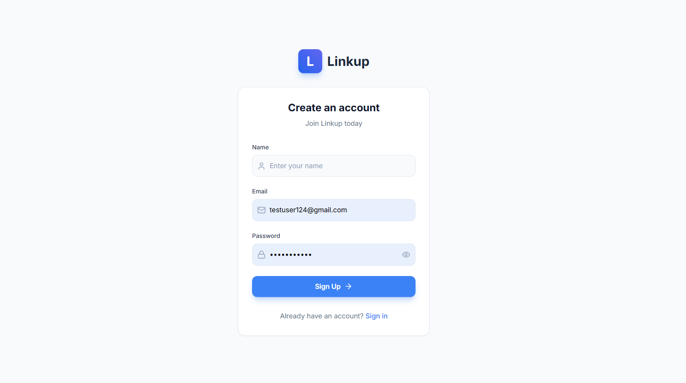
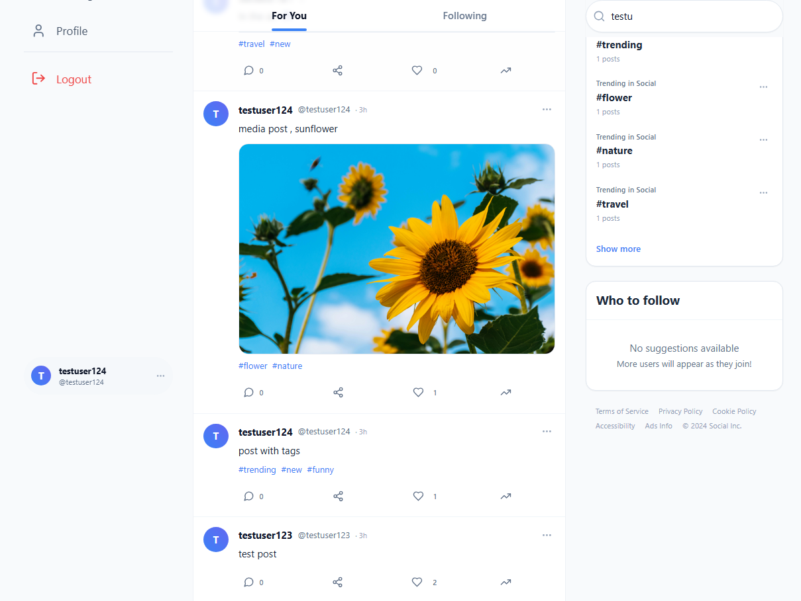
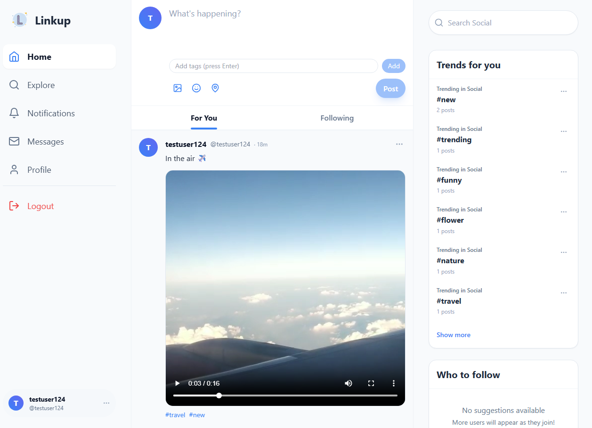
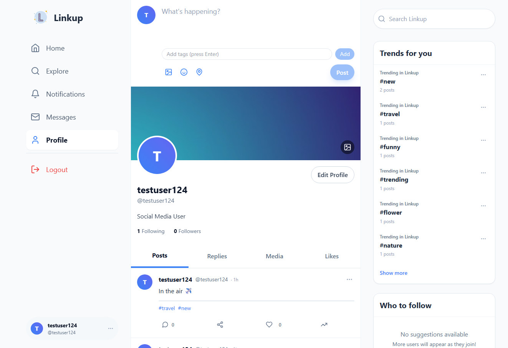
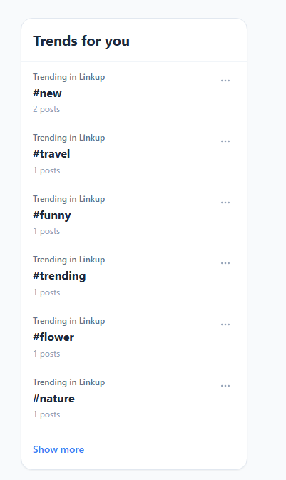
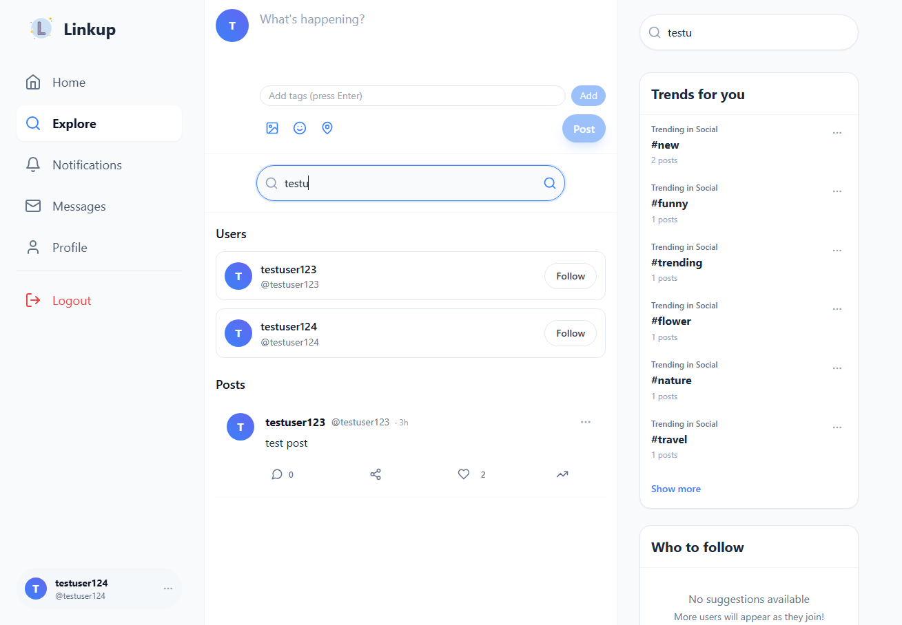

# LinkUp

> Connect, Share, and Inspire — A Modern Social Media Platform

---

## Features

### Login Signup (User Authentication)

  
  

### Media Upload in Cloudflare R2 

  
  

### User Profiles

### Trending Page -> Shows Trending Hashtags Based on Like Count and Number of Posts

### Search Users and Posts by Username and Hashtags

---

## Tech Stack

- **Frontend:** React, Vite, Tailwind CSS
- **Backend:** Node.js, Express.js
- **Database:** (Configured in server/config/database.js)
- **API:** RESTful endpoints
- **Authentication:** JWT, Context API
- **Media Storage:** Clouflare R2
- **Other:** Axios , RateLimiting , Infinite Scroll , Filtering

